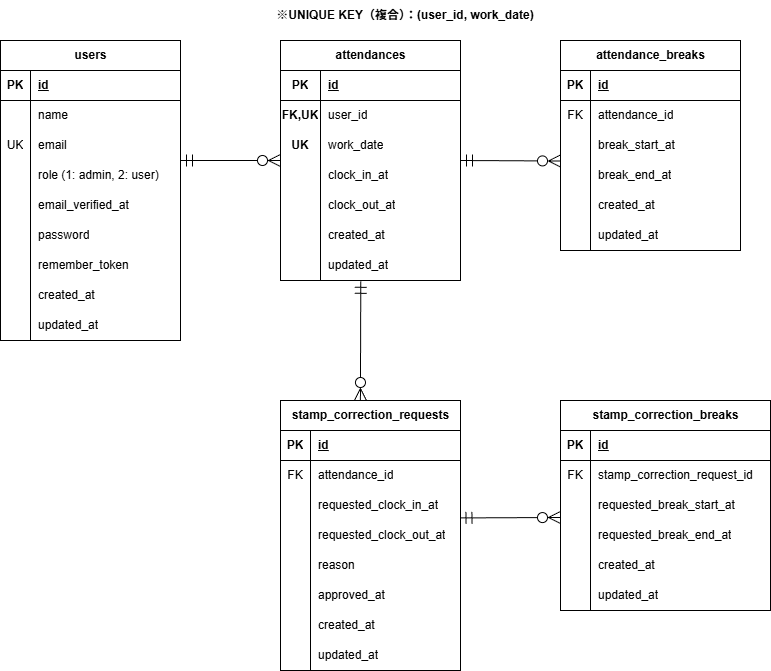

# Time_and_Attendance_Management_App

## アプリ概要


---

## 使用技術（実行環境）
- PHP 8.1.34
- Laravel 8.83.29
- MySQL 8.0.26
- nginx 1.21.1
- Docker / Docker Compose
- HTML / CSS（Bladeテンプレート）

## 開発・テスト・外部サービス
- PHPUnit
- MailHog

---

## 環境構築

### Dockerビルド
1. リポジトリをクローン
```bash
git clone https://github.com/yakhrc5/Attendance-App.git
```

2. 作業ディレクトリに移動
```bash
cd Attendance-App
```

3. Docker Desktopを起動
4. Dockerコンテナをビルドして起動
```bash
docker compose up -d --build
```

### Laravel環境構築
1. パッケージをインストール
```bash
docker compose exec php composer install
```

2.  `.env` ファイルを作成
```bash
cp src/.env.example src/.env
```

3. アプリケーションキーの作成
``` bash
docker compose exec php php artisan key:generate
```

4. マイグレーション・シーディングを実行
``` bash
docker compose exec php php artisan migrate --seed
```

5. storage / bootstrap/cache の権限を設定
```bash
docker compose exec php chown -R www-data:www-data /var/www/storage /var/www/bootstrap/cache
docker compose exec php chmod -R 775 /var/www/storage /var/www/bootstrap/cache
```

## URL
- 開発環境: http://localhost/
- phpMyAdmin: http://localhost:8080/
- MailHog: http://localhost:8025/

## ログイン情報

### 管理者
以下のユーザーでログインできます。

- メールアドレス: `admin@example.com`
- パスワード: `password123`

※ 上記管理者はシーディングで登録されます。

---

### 一般ユーザー
以下のユーザーでログインできます。

- ユーザー名: '山田 太郎'
- メールアドレス: `user1@example.com`
- パスワード: `password123`

- ユーザー名: '佐藤 花子'
- メールアドレス: `user1@example.com`
- パスワード: `password123`

※ 上記ユーザーはシーディングで登録されます。

---

## テスト環境構築
テスト実行時は `.env.testing` の設定を使用します。  
テスト用データベースとして `flea_market_testing` を利用します。

※ 以下のコマンドは、プロジェクトルートでホスト側から実行してください。

1. `.env.testing` ファイルを作成
```bash
cp src/.env.testing.example src/.env.testing
```

2. テスト用データベースを作成
```bash
docker compose exec mysql mysql -uroot -proot -e "CREATE DATABASE IF NOT EXISTS flea_market_testing;"
```

3. テスト用アプリケーションキーの作成
``` bash
docker compose exec php php artisan key:generate --env=testing
```

4. テストの実行
``` bash
docker compose exec php php artisan test
```

---

## ER図

